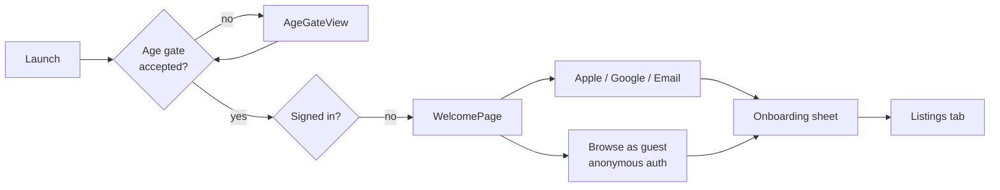
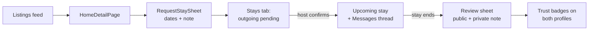
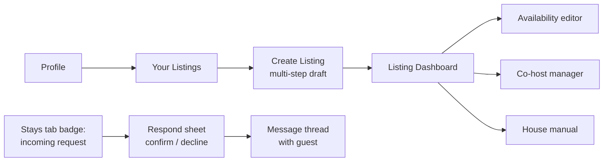

# FreeBNB Product Spec: Information Architecture & User Flows

This is the document a product manager would maintain alongside the Figma file: what the surfaces are, why they exist, how users move between them, and which decisions are settled versus open. Everything here reflects the shipped code as of July 2026.

---

## 1. Product one-pager

**Problem.** People with spare rooms want to host friends, and travelers trust a friend's couch more than a stranger's listing. General-purpose platforms (Airbnb, Couchsurfing) optimize for strangers, which forces heavy trust machinery (payments, IDs, reviews from unknowns) onto relationships that already have trust built in.

**Product.** A free, friends-only home-sharing app. Every listing is visible only to the host's accepted friends. No payments, no public marketplace, no discovery by strangers.

**Core principle.** *The friend graph is the trust model.* Visibility, messaging, and stay requests are all gated by an accepted friendship. Friends-of-friends surface only as friend suggestions, never as listing visibility (decided July 2026; earlier "everyone" and "friends-of-friends" visibility tiers were removed and migrated).

**Primary personas.**
- **Guest**: browsing where friends live, requesting stays around trips.
- **Host**: listing a space, setting availability, screening requests.
- Most users are both; the IA deliberately does not split the app into guest mode and host mode.

---

## 2. Information architecture

### Tab bar (5 tabs)

| # | Tab | Icon | Badge | Job to be done |
|---|-----|------|-------|----------------|
| 0 | **Listings** | house | none | "Where can I stay?" Browse the friend-scoped feed, map, filters, saved listings. |
| 1 | **Stays** | suitcase | pending request count | "What's the state of my trips?" Incoming and outgoing requests, upcoming and past stays. |
| 2 | **Messages** | message | unread count | "Talk to the host/guest." Per-listing conversations with stay context inline. |
| 3 | **Profile** | person | none | "Manage me." Own profile, my listings, settings, account. |
| 4 | **Info** | book | none | "How does this work?" Docs, FAQ, safety, changelog, feedback. |

**Rationale for this split.**
- Listings vs. Stays separates *discovery* (open-ended browsing) from *state* (requests with deadlines). Badges only appear where action is owed (Stays, Messages), so a badge always means "someone is waiting on you."
- Hosting lives under Profile → Your Listings rather than a sixth tab. Most sessions are guest-mode sessions; a dedicated Host tab would sit empty for users who never list. This mirrors Airbnb's "hosting is a mode, not a tab" decision at comparable scale.
- Friends is a sheet off Listings (the friends control in the feed header), not a tab. The friend graph is infrastructure for visibility, not a destination people check daily. This is the most debatable IA call; see Open Questions.

### Global surfaces (outside the tabs)

| Surface | Trigger |
|---------|---------|
| Age gate | First launch, before anything else |
| Welcome / Auth | Signed out (Apple, Google, email, anonymous browse) |
| Onboarding sheet | First signed-in launch |
| What's New sheet | First launch after a version update (suppressed right after install) |
| Offline banner | Network loss, overlaid on every screen |

---

## 3. Page inventory by tab

### Tab 0: Listings
- **HomesPage** (root): paginated feed ranked for the viewer, filter chips, city search, friends sheet, map sheet.
- **ListingsMapView** (sheet): clustered map of the same feed.
- **FriendsPage** (sheet): accepted friends, requests, QR invite, friend suggestions (the only place friends-of-friends appear), network reach stats.
- **HomeDetailPage** (push): photos placeholder, amenities, availability calendar, house manual, reviews, host card → UserProfilePage, actions: Request Stay (sheet), Message Host, Report (sheet).
- **RequestStaySheet**: dates, party size, note to host.
- **UserProfilePage** (push): trust badges, reviews, references, Write Reference (sheet), Report (sheet).

### Tab 1: Stays
- **StaysTab** (root): sectioned list of incoming requests (host view), outgoing requests (guest view), upcoming and past stays. Row taps push HomeDetailPage when the listing is cached.
- Sheets: respond to request, modify dates, write review, send thanks, share stay (calendar invite / .ics).

### Tab 2: Messages
- **MessagesTab** (root): conversation list with listing context. Owns its own NavigationStack so push-notification deep links can programmatically push a thread.
- **MessageThread** (push): bubbles, stay request banner with accept/decline inline, stay event cards, listing context banner, rate-limited input.

### Tab 3: Profile
- **ProfilePage** (root): identity card → own UserProfilePage, Your Listings, notification settings, appearance, data export, sign out, delete account. Anonymous users see Create Account here.
- **YourListingsPage** (push) → **ListingDashboardPage** (per listing: requests, availability editor, co-host manager, house manual editor) → **CreateListingPage** (multi-step draft).

### Tab 4: Info
- **InfoPage** (root): What's New, Feature Spotlight, About, How It Works, Features, FAQ, Guest Tips, Safety Guidelines; feedback composer (sheet).

---

## 4. Key user flows

### 4.1 First run → signed in

Sign-in always lands on Listings (tab selection is persisted across launches, but reset on sign-in so a returning user is not dropped onto a stale tab).

### 4.2 Guest requests a stay (the core loop)

### 4.3 Host lifecycle

### 4.4 Cross-tab handoffs (deep links)

| Trigger | Destination |
|---------|-------------|
| Push notification: new message | Messages tab, thread pushed |
| Push notification: stay event | Stays tab |
| Spotlight result (saved listing) | Listings tab, detail pushed if loaded |
| "Message host" on a listing | Messages tab, thread with listing context |

All routing goes through a single `DeepLinkRouter` observable; ContentView owns tab selection and reacts to pending route state. No view navigates another tab directly.

---

## 5. Navigation model (the rules)

1. **One NavigationStack per tab.** State per tab survives tab switches. Only Messages exposes its path for programmatic pushes (deep links).
2. **Push = drill-down into content** (listing detail, profile, thread, dashboard). **Sheet = task or aside** (request stay, respond, review, report, filters, friends, feedback). A sheet always returns you exactly where you were.
3. **Badges are obligations.** Stays badge counts requests awaiting your response; Messages badge counts unread. Nothing else badges.
4. **Anonymous users can browse but not act.** Request/message/list actions funnel to Create Account, reachable from Profile.

---

## 6. Settled decisions and their tradeoffs

| Decision | Alternative rejected | Why |
|----------|---------------------|-----|
| Friends-only visibility, single tier | Everyone / friends-of-friends tiers (shipped, then removed July 2026) | Multiple tiers made "who can see my home" ambiguous, which is fatal for a trust product. FoF kept only as friend *suggestions*. Required a data migration with ordered steps. |
| 5 tabs, hosting under Profile | 6th Host tab, or Airbnb-style mode switch | Not enough hosts-only users to justify the empty surface; a mode switch hides half the app. |
| Photos scaffolded, not shipped | Ship photo upload in v1 | Moderation, storage cost, and abuse surface outweighed launch value for a friends-only graph where you know the host. `PhotoUploader` seam and Storage rules exist so it can ship without refactoring. |
| Reviews = public review + private note | Public-only (Airbnb model) | Friends need a channel for honest feedback that does not damage the friendship publicly. |
| Blocking enforced in Firestore security rules | Client-side filtering only | Client filtering is cosmetic; a blocked user could still read data with a modified client. |

---

## 7. Open questions (next IA iterations)

1. **Friends placement.** A sheet off Listings under-serves the growth loop (inviting friends is how the feed gets bigger). Candidates: promote to a Profile row, a dedicated tab replacing Info, or a persistent header entry point. Needs usage data before restructuring.
2. **Info as a tab.** Eight static pages probably do not earn a permanent tab slot. Likely future: fold into Profile as a Help section, freeing the slot if Friends is promoted.
3. **Stays vs. Messages overlap.** Stay request banners appear in threads and request rows appear in Stays; the same accept action exists in two places. Intentional (meet the user where they are) but worth watching for confusion.
4. **Host discoverability.** "List your home" is three levels deep (Profile → Your Listings → Create). If host supply becomes the constraint, it needs a feed-level entry point.
